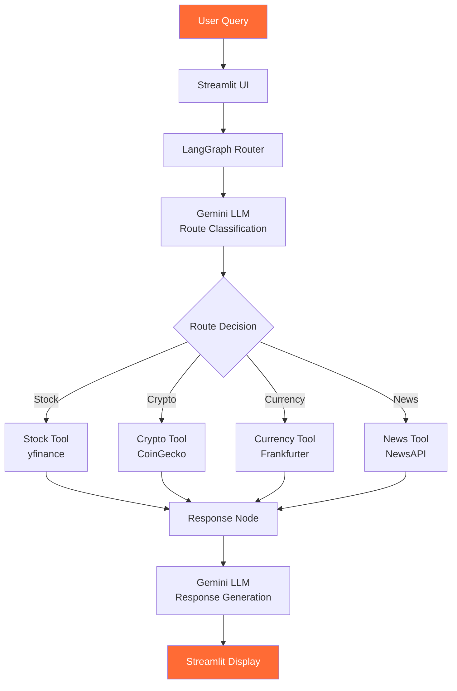
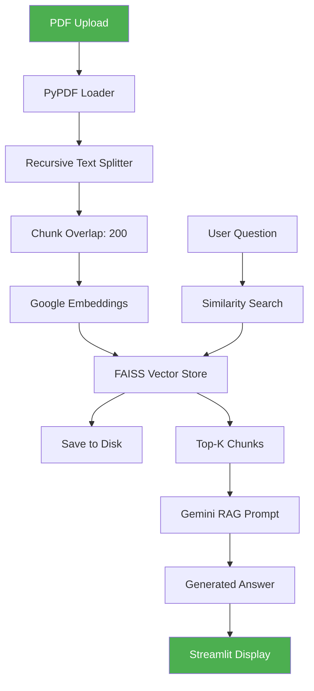
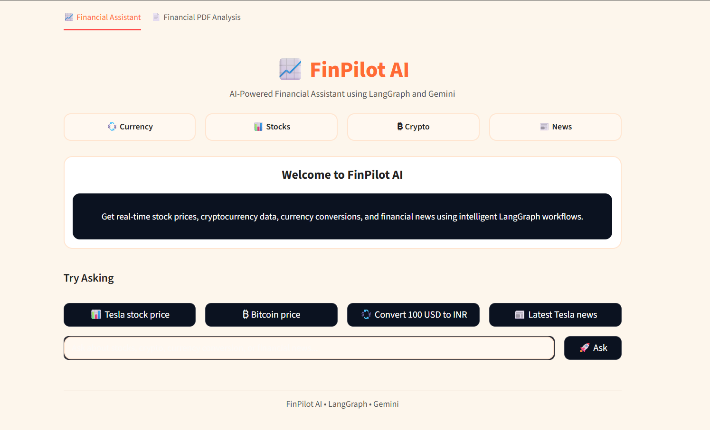
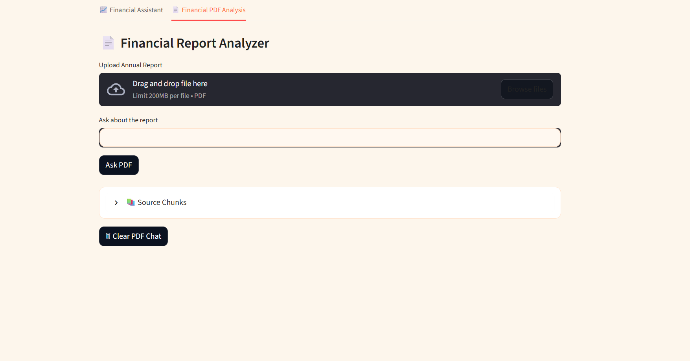

# 📈 FinPilot AI

<p align="center">
  <a href="https://github.com/SathwikReddy-Bushireddy/finpilot-ai">
    
  </a>
  <a href="https://github.com/SathwikReddy-Bushireddy/finpilot-ai">
    
  </a>
  <a href="https://github.com/SathwikReddy-Bushireddy/finpilot-ai">
    
  </a>
</p>

FinPilot AI is an **AI-powered financial assistant** built with modern AI technologies including **LangGraph**, **LangChain**, and **Google Gemini**. It provides two powerful features: a real-time Financial Assistant for stock, crypto, currency, and news queries, and a Financial PDF Analyzer for parsing and analyzing annual reports, financial statements, and other financial documents.

---

## 🚀 Features

### 📊 Financial Assistant

| Feature | Description | Data Source |
|---------|-------------|-------------|
| 💱 **Currency Conversion** | Convert between 30+ currencies with live exchange rates | [Frankfurter API](https://www.frankfurter.app/) |
| 📈 **Stock Price Analysis** | Get real-time stock prices, day high/low, company info | [Yahoo Finance](https://finance.yahoo.com/) (yfinance) |
| ₿ **Cryptocurrency Prices** | Track Bitcoin, Ethereum, and 100+ cryptocurrencies | [CoinGecko API](https://www.coingecko.com/en/api) |
| 📰 **Financial News** | Latest news on stocks, crypto, and financial topics | [NewsAPI](https://newsapi.org/) |
| 💾 **Conversation Memory** | Context-aware conversations using LangGraph state management | LangGraph |

### 📄 Financial PDF Analyzer

| Feature | Description |
|---------|-------------|
| 📂 **PDF Upload** | Upload annual reports, 10-K filings, financial statements |
| 🔀 **Intelligent Chunking** | Smart text splitting with overlap for context preservation |
| 🗂️ **Vector Embeddings** | Google Generative AI embeddings for semantic search |
| 🔍 **FAISS Search** | High-performance similarity search with FAISS |
| 📝 **RAG Pipeline** | Retrieval-Augmented Generation for accurate answers |
| 📋 **Executive Summary** | Auto-generated executive summaries |
| ⚠️ **Risk Analysis** | Identify and analyze financial risks |
| 📈 **Growth Analysis** | Revenue growth and expansion insights |
| 💰 **Profitability Analysis** | Margins, net income, cost structure |
| 📚 **Source Chunks** | View source documents for verification |
| 💬 **PDF Conversation** | Chat memory for PDF analysis |

---

## 🏗️ Architecture

### Financial Assistant Workflow



### PDF Analysis Workflow



---

## 📁 Project Structure

```
FinPilot-AI/
├── app.py                      # Main Streamlit application
├── requirements.txt            # Python dependencies
├── .env                       # Environment variables
├── .gitignore                 # Git ignore rules
│
├── graph/                     # LangGraph workflow
│   ├── state.py              # State schema definition
│   └── workflow.py          # Compiled LangGraph
│
├── nodes/                     # LangGraph nodes
│   ├── router.py            # Route classification
│   ├── extractor_node.py   # Data extraction
│   ├── stock_node.py       # Stock tool node
│   ├── crypto_node.py     # Crypto tool node
│   ├── currency_node.py  # Currency tool node
│   ├── news_node.py      # News tool node
│   └── response_node.py # Response generation
│
├── rag/                      # PDF RAG pipeline
│   ├── pdf_loader.py      # PyPDF loader
│   ├── text_splitter.py   # Text chunking
│   ├── vector_store.py   # FAISS vector store
│   ├── retriever.py      # Similarity search
│   └── rag_chain.py     # RAG chain & insights
│
├── tools/                    # LangChain tools
│   ├── stock_tool.py     # yfinance tool
│   ├── crypto_tool.py   # CoinGecko tool
│   ├── currency_tool.py # Frankfurter tool
│   └── news_tool.py   # NewsAPI tool
│
├── utils/                    # Utilities
│   └── gemini.py       # Gemini LLM setup
│
├── tests/                    # Unit tests
│   ├── test.py
│   ├── test_pdf.py
│   ├── test_faiss.py
│   └── test_retriever.py
│
├── uploads/                  # Uploaded PDFs
└── faiss_index/            # FAISS index files
```

---

## 🛠️ Technologies Used

| Category | Technology |
|----------|------------|
| **Frontend** | [Streamlit](https://streamlit.io/) |
| **AI Orchestration** | [LangGraph](https://langchain-ai.github.io/langgraph/) |
| **AI Framework** | [LangChain](https://www.langchain.com/) |
| **LLM** | [Google Gemini 2.5 Flash](https://ai.google.dev/) |
| **Embeddings** | [Gemini Embeddings](https://ai.google.dev/) |
| **Vector Database** | [FAISS](https://faiss.ai/) |
| **PDF Processing** | [PyPDFLoader](https://pypdf.readthedocs.io/) |
| **Stock Data** | [yfinance](https://pypi.org/project/yfinance/) |
| **Crypto Data** | [CoinGecko API](https://www.coingecko.com/) |
| **Currency Data** | [Frankfurter API](https://www.frankfurter.app/) |
| **News Data** | [NewsAPI](https://newsapi.org/) |

---

## 📦 Installation

### 1. Clone the Repository

```bash
git clone https://github.com/SathwikReddy-Bushireddy/finpilot-ai.git
cd FinPilot-AI
```

### 2. Create Virtual Environment

```bash
# Windows
python -m venv venv
venv\Scripts\activate

# Linux/Mac
python3 -m venv venv
source venv/bin/activate
```

### 3. Install Dependencies

```bash
pip install -r requirements.txt
```

### 4. Environment Setup

Create a `.env` file in the project root:

```env
GOOGLE_API_KEY=your_gemini_api_key_here
NEWS_API_KEY=your_newsapi_key_here
```

> **Note:** Get your API keys from:
> - Google AI Studio: https://aistudio.google.com/app/apikey
> - NewsAPI: https://newsapi.org/register

### 5. Run the Application

```bash
streamlit run app.py
```

The app will open at `http://localhost:8501`

---

## 📖 Usage

### Financial Assistant

1. Open the app in your browser
2. Select the **📈 Financial Assistant** tab
3. Ask questions like:
   - 💱 "Convert 100 USD to INR"
   - 📈 "What's Tesla's stock price?"
   - ₿ "Bitcoin price in INR"
   - 📰 "Latest Apple news"
4. View the response with tool attribution

### PDF Analyzer

1. Select the **📄 Financial PDF Analysis** tab
2. Upload a PDF (annual report, 10-K, financial statement)
3. Wait for the vector store to build
4. View the executive summary
5. Use preset insights or ask custom questions:
   - "Summarize revenue growth"
   - "What are the risk factors?"
   - "Analyze profitability"
6. View source chunks for verification

---

## 📸 Screenshots

> **Note:** Add your screenshots here

### Financial Assistant


### PDF Analyzer


---

## 🔮 Future Enhancements

- 📊 **Multi-PDF Analysis** - Compare multiple financial reports
- 💼 **Portfolio Tracker** - Track investments and portfolio performance
- 📈 **Financial Forecasting** - AI-powered financial predictions
- 🎙️ **Voice Assistant** - Voice-based financial queries
- 📉 **Comparative Analysis** - Compare companies side-by-side
- 📱 **Mobile App** - iOS and Android applications
- 🔌 **More Data Sources** - Bloomberg, Reuters, Alpha Vantage

---

## 🎓 Key Learning Outcomes

This project demonstrates proficiency in:

| Skill | Description |
|-------|-------------|
| 🧠 **LangGraph Orchestration** | Building complex AI workflows with state management |
| 🔧 **Tool Calling** | Integrating external APIs as LangChain tools |
| 💾 **State Management** | Conversation memory with LangGraph |
| 📚 **RAG Implementation** | Retrieval-Augmented Generation for document Q&A |
| 🗄️ **Vector Databases** | FAISS for semantic search |
| ✍️ **Prompt Engineering** | Optimizing LLM prompts for financial tasks |
| 🌐 **Streamlit Deployment** | Building production-ready web apps |

---

## 📝 License

This project is licensed under the **MIT License**.

---

## 👤 Author

<p align="center">
  <a href="https://linkedin.com/in/sathwikreddy">
    
  </a>
  <a href="https://github.com/SathwikReddy-Bushireddy">
    
  </a>
</p>

- **Name**: [Your Name]
- **LinkedIn**: [Your LinkedIn Profile]
- **GitHub**: [Your GitHub Profile]

---

## ⭐ Show Your Support

If you found this project helpful, please give it a ⭐ on GitHub!

---

<p align="center">
  <sub>Built with ❤️ using LangGraph, LangChain, and Google Gemini</sub>
</p>